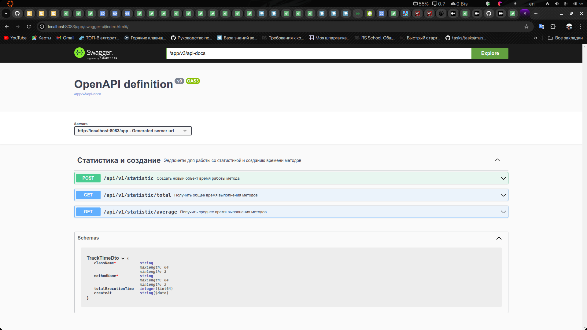
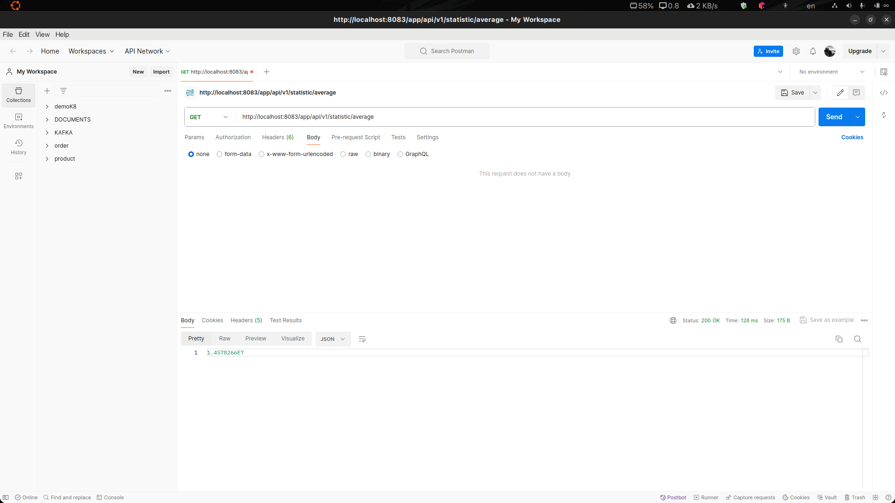
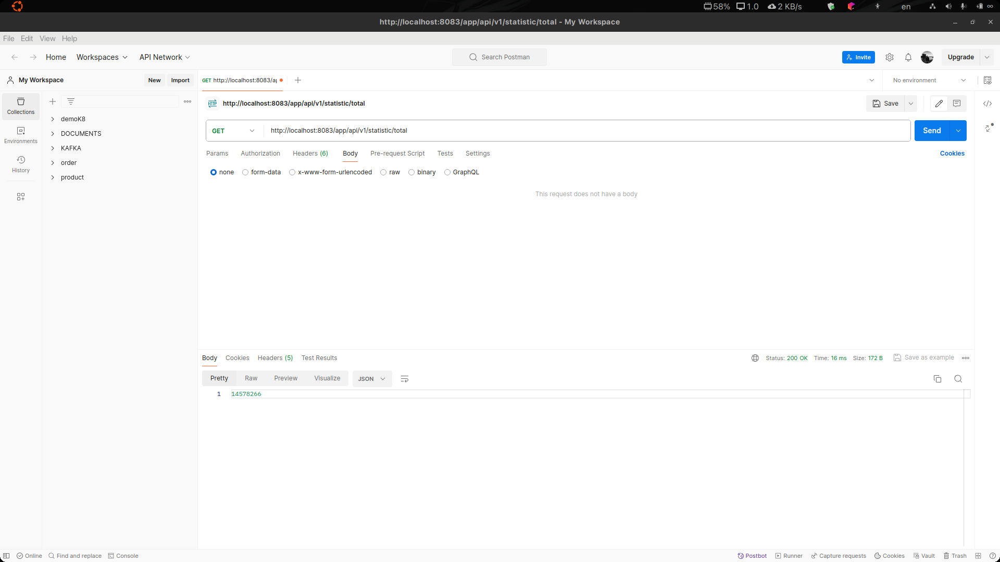
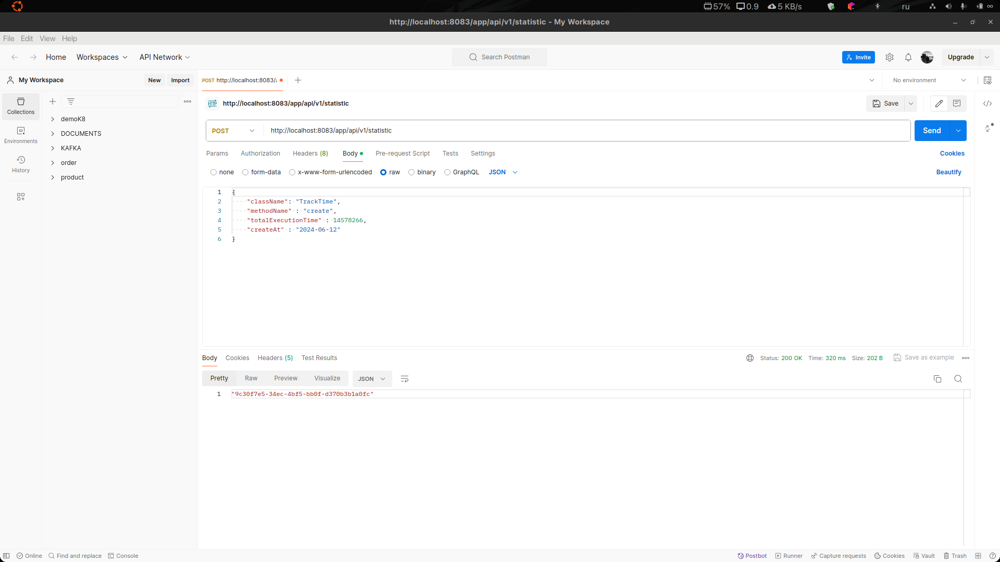

# Задание: Реализация системы учета времени выполнения методов для компании T1

### Описание:

- Вам предстоит разработать систему учета времени выполнения методов в приложении с использованием Spring AOP.
- Система должна быть способна асинхронно логировать и анализировать данные о времени выполнения методов.

### Требования:

- Создайте аннотации @TrackTime и @TrackAsyncTime, которые можно применять к методам для отслеживания времени их
  выполнения.
  Реализуйте аспекты, используя Spring AOP, для асинхронного и синхронного отслеживания времени выполнения методов,
  помеченных соответствующими аннотациями.
  Создайте сервис, который будет асинхронно сохранять данные о времени выполнения методов в базе данных.
  Реализуйте REST API для получения статистики по времени выполнения методов (например, среднее время выполнения, общее
  время выполнения) для различных методов и их групп.
  Настройте приложение с помощью конфигурации Spring для включения использования AOP и асинхронной обработки данных.

### Критерии оценки:

- Реализация аспектов:
  Правильное применение Spring AOP для создания аспектов.
  Корректное определение точек среза для методов, помеченных аннотациями @TrackTime и @TrackAsyncTime.
  Обработка исключений и ошибок в аспектах.

- Обработка асинхронных вызовов:
  Асинхронное отслеживание времени выполнения методов, помеченных аннотацией @TrackAsyncTime.
  Корректная обработка результатов асинхронных операций.

- Хранение и анализ данных:
  Реализация сервиса для асинхронного сохранения данных о времени выполнения методов в базе данных.
  Корректное хранение данных в базе данных.
  Реализация механизма анализа данных для получения статистики по времени выполнения методов.

- REST API:
  Создание REST API для получения статистики по времени выполнения методов.
  Корректная обработка запросов и передача данных в формате JSON.
  Документация API.

- Качество кода и архитектура:
  Чистота, читаемость и модульность кода.
  Соблюдение принципов SOLID и других принципов проектирования.
  Правильное использование паттернов проектирования.

# Cтек проекта

- SpringBoot
- Java 17
- Hibernate (Spring Data)
- Liquibase
- Postgres
- Stream API
- Springdoc-openapi(Swagger-ui)

# Swagger

- Страница с эндпоинтами
  

# Postman

- Получение среднего времени всех методов
  

- Получение общего времени всех методов
  

- Создание записи в бд
  

